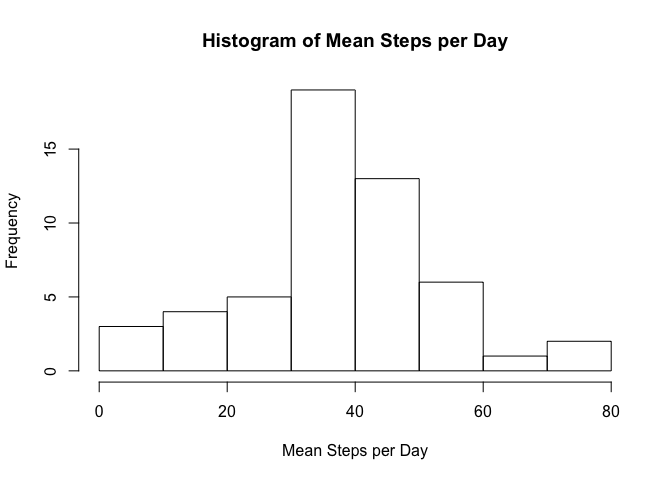
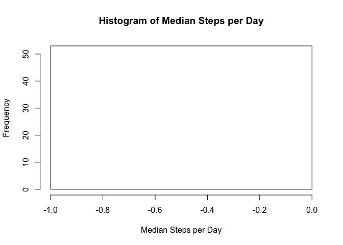

# Reproducible Research: Peer Assessment 1
Jaret Langston  
April 10, 2016  


## Loading and preprocessing the data

```r
        #Read the raw data file
        activity_Raw <- read.csv("activity.csv")
        #presere the raw data for future use and move to a new vairiable for cleaning
        activity_Clean <- activity_Raw
        #Remove any incomplete rows
        activity_Clean <- na.omit(activity_Clean)
```


## What is mean total number of steps taken per day?

```r
        #get only the steps and date columns
        mysteps <- activity_Clean[,c('steps','date')]
        #group the dataframe by date
        mysteps <- dplyr::group_by(mysteps,date)
        #calculate the total sum of steps, mean steps, and median steps by date
        sumSteps <- dplyr::summarise(mysteps, tSteps = sum(steps),meanSteps = mean(steps), medianSteps = median(steps))
         #Plot histogram of total steps per day
       plot(sumSteps$date,sumSteps$tSteps, type = 'h',
             xlab = "Date",ylab = "Total Steps", 
             main = "Histogram of Total Steps per Day")
```

<!-- -->

```r
       #Plot histogram of mean steps per day
       plot(sumSteps$date,sumSteps$meanSteps, type = 'h',
            xlab = "Date",ylab = "Mean Steps", 
            main = "Histogram of Mean Steps per Day")
```

<!-- -->

```r
       #Plot histogram of median steps per day
       plot(sumSteps$date,sumSteps$medianSteps, type = 'h',
            xlab = "Date",ylab = "Median Steps", 
            main = "Histogram of Median Steps per Day")    
```

<!-- -->


## What is the average daily activity pattern?

```r
        #get only the steps and interval columns
        mysteps <- activity_Clean[,c('steps','interval')]
        #group the dataframe by interval
        mysteps <- dplyr::group_by(mysteps,interval)
        #calculate the total mean steps by interval
        sumSteps <- dplyr::summarise(mysteps, meanSteps = mean(steps))
         #Plot histogram of mean steps per interval
       plot(sumSteps$interval,sumSteps$tSteps, type = 'l',
             xlab = "Interval",ylab = "Mean Steps", 
             main = "Histogram of Mean Steps per Interval")
```

<!-- -->


## Imputing missing values

```r
       #calculate the number of rows with NA 
       print(paste("Complete Rows: ",as.character(nrow(activity_Clean))))
```

```
## [1] "Complete Rows:  15264"
```

```r
        print(paste("Number of rows with NA: ",as.character(nrow(activity_Raw) - nrow(activity_Clean))))
```

```
## [1] "Number of rows with NA:  2304"
```

```r
        #Get fresh copy of the raw data
        activity_Updated <- activity_Raw
        #Update the NA values with the mean of the intervals
        activity_Updated$steps[is.na(activity_Updated$steps)] <- activity_Clean$steps[activity_Clean$interval == activity_Updated$interval]
```

```
## Warning in activity_Clean$interval == activity_Updated$interval: longer
## object length is not a multiple of shorter object length
```

```
## Warning in activity_Updated$steps[is.na(activity_Updated$steps)] <-
## activity_Clean$steps[activity_Clean$interval == : number of items to
## replace is not a multiple of replacement length
```

```r
         #get only the steps and date columns
        mysteps <- activity_Updated[,c('steps','date')]
        #group the dataframe by date
        mysteps <- dplyr::group_by(mysteps,date)
        #calculate the total sum of steps, mean steps, and median steps by date
        sumSteps <- dplyr::summarise(mysteps, tSteps = sum(steps),meanSteps = mean(steps), medianSteps = median(steps))
         #Plot histogram of total steps per day
       plot(sumSteps$date,sumSteps$tSteps, type = 'h',
             xlab = "Date",ylab = "Total Steps", 
             main = "Histogram of Total Steps per Day w/o NA")
```

<!-- -->

Total steps per day is not very different from earlier plot, but does include values that were missing before.


```r
       #Plot histogram of mean steps per day
       plot(sumSteps$date,sumSteps$meanSteps, type = 'h',
            xlab = "Date",ylab = "Mean Steps", 
            main = "Histogram of Mean Steps per Day w/o NA")
```

<!-- -->

Mean steps per day is not very different from earlier plot, but does include values that were missing before.


```r
       #Plot histogram of median steps per day
       plot(sumSteps$date,sumSteps$medianSteps, type = 'h',
            xlab = "Date",ylab = "Median Steps", 
            main = "Histogram of Median Steps per Day w/o NA") 
```

<!-- -->

Median steps per day now does not have any missing values as compared to the earlier plot.


## Are there differences in activity patterns between weekdays and weekends?

```r
    #create a vector of weekdays
        weekdays1 <- c('Monday', 'Tuesday', 'Wednesday', 'Thursday', 'Friday')
       #add a column inidcating if it is a weekday or weekend
        activity_Updated$wDay <- c('weekend', 'weekday')[(weekdays(as.Date(activity_Updated$date)) %in% weekdays1)+1L]
        #break out the data by weekday and weekend for analysis of steps per interval
        mystepsWeekday <- activity_Updated[activity_Updated$wDay == 'weekday',c('steps','interval')]
        mystepsWeekend <- activity_Updated[activity_Updated$wDay == 'weekend',c('steps','interval')]
        #group the dataframe by Interval
        mystepsWeekday <- dplyr::group_by(mystepsWeekday,interval)
        mystepsWeekend <- dplyr::group_by(mystepsWeekend,interval)
        #calculate the total sum of steps by interval
        sumStepsWeekday <- dplyr::summarise(mystepsWeekday, tSteps = sum(steps))
        sumStepsWeekend <- dplyr::summarise(mystepsWeekend, tSteps = sum(steps))
        #setup plot space
        oldpar <- par(mfrow=c(2,1), mar=c(3,3,1,1), oma=c(0,0,3,1))  ## oma creates space 
        #layout plots
        plot(sumStepsWeekend$interval,sumStepsWeekend$tSteps, type='l', main="Weekend", xlab = "Interval", ylab = "Total Steps")
        plot(sumStepsWeekday$interval,sumStepsWeekday$tSteps, type='l', main="Weekday", xlab = "Interval", ylab = "Total Steps")
        mtext("Average steps for weekend and weekday", side=3, line=1, outer=TRUE, cex=2, font=2)
```

<!-- -->

```r
        #render plots
        par(oldpar)
```

As shown in the plots, there are more steps taken during most intervals than during weekdays in the same intervals.
